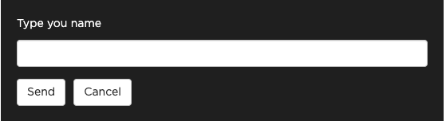
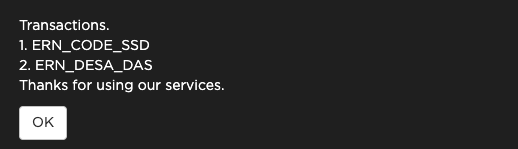
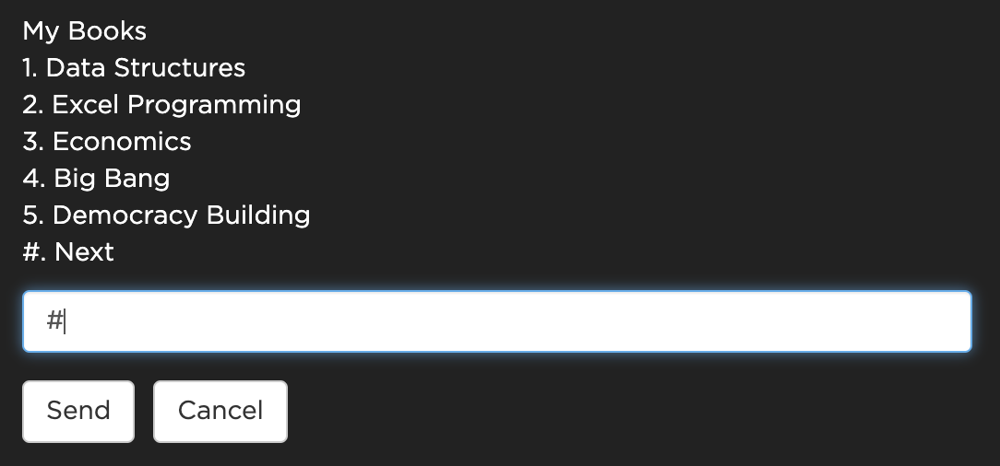
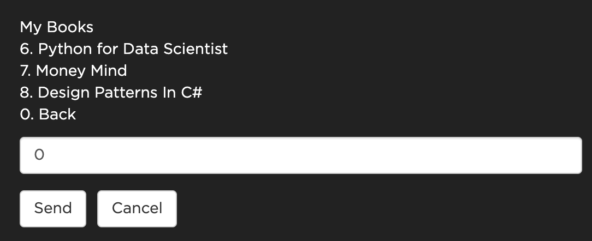
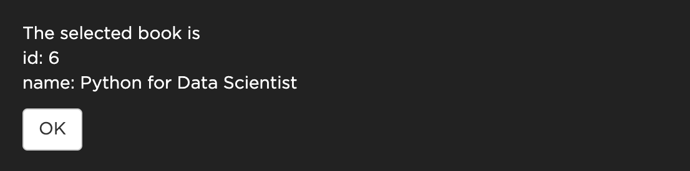

# JoyUssdEngine

A ruby library for building text based applications rapidly. It supports building whatsapp, ussd, telegram and various text or chat applications that communicate with your rails backend. With this library you can target multiple platforms(whatsapp, ussd, telegram, etc.) at once with just one codebase.

## Installation

Add this line to your application's Gemfile:

```ruby
gem 'joy_ussd_engine'
```

And then execute:

    $ bundle install

Or install it yourself as:

    $ gem install joy_ussd_engine

## Usage

The ussd engine handles user session and stores user data with redis. So in your `Gemfile` you will have to add the `redis` and the `redis-namespace` gem.
```ruby
gem 'redis'
gem 'redis-namespace'

# Not required but you can add connection pool for redis if you want
gem 'connection_pool', '~> 2.2', '>= 2.2.2'
```

After installing redis you will need to setup the redis config in your rails application inside `config/initializers/redis.rb` 
```ruby
# With Connection Pool
require 'connection_pool'
NAMESPACE = :DEFAULT_NAMESPACE
REDIS = ConnectionPool.new(size: 10) { Redis::Namespace.new(NAMESPACE, :redis => Redis.new) }
```

```ruby
# Without Connection Pool
NAMESPACE = :DEFAULT_NAMESPACE
REDIS = Redis::Namespace.new(NAMESPACE, :redis => Redis.new)
```

### Starting the App

In your rails app inside a controller create a post route and initialize the `JoyUssdEngine` by calling `JoyUssdEngine::Core.new` and providing some parameters. [Click here](#params) to view all the required parameters list.

```ruby
class MyController < ApplicationController
  skip_before_action :verify_authenticity_token

  def create
    joy_ussd_engine = JoyUssdEngine::Core.new(ussd_params, Transformers::HubtelTransformer, start_point: Ussd::Menus::StartMenu, end_point: Ussd::Menus::EndMenu)
    response = joy_ussd_engine.process
    render json: response, status: :created
  end

  def ussd_params
    params.permit(:SessionId, :Mobile, :ServiceCode, :Type, :Message, :Operator, :Sequence, :ClientState)
  end
end
```

The `JoyUssdEngine::Core.new` class takes the following parameters.<a id="params"></a>

| Parameter                        | Type  | Description                                                                                                                           |
| -------------------------------- | ----- | ------------------------------------------------------------------------------------------------------------------------------------- |
| params                           | hash  | Params coming from a post end point in a rails controller                                                                             |
| [data_transformer](#transformer) | class | A class to transform the incoming and outgoing request between a particular provider and `JoyUssdEngine`                              |
| [start_point](#menu)             | class | Points to a menu that starts the application. This menu is the first menu that loads when the app starts                              |
| [end_point](#menu)               | class | This menu will terminate the ussd session if a particular provider (`data_transformer`) returns true in  the `app_terminator` method. |

### <a id="transformer">DataTransformer</a>

A data transformer transforms the incoming request and outgoing response between a particular provider and the `JoyUssdEngine` so they can effectively communicate between each other. The `JoyUssdEngine` can accept any request object but there are two required fields that needs to be present for it to work properly. The required fields are `session_id` and `message`. This is why the `DataTransformer` is needed to convert the request so it can provide this two required fields (`session_id`, `message`).

- #### Methods

| Method         | Parameters                                 | Return Value  | Description                                                                                                                                                                                             |
| -------------- | ------------------------------------------ | ------------- | ------------------------------------------------------------------------------------------------------------------------------------------------------------------------------------------------------- |
| request_params | params: [hash]()                           | [hash]()      | Converts the incoming request into a format the ussd engine can understand. The hash is the params coming from the post request in a rails controller that calls `JoyUssdEngine::Core.new`.             |
| response       | message: [string](), app_state: [string]() | [hash]()      | Converts the outgoing response coming from the ussd engine into a format the provider can understand. `(eg of providers: Whatsapp, Twilio, Hubtel, Telegram, etc.)`                                     |
| release        | message: [string]()                        | [hash]()      | Converts the outgoing response coming from the ussd engine into a format the provider can understand and then terminates the application. `(eg of providers: Whatsapp, Twilio, Hubtel, Telegram, etc.)` |
| app_terminator | params: [hash]()                           | [boolean]()   | Returns a true/false on whether to terminate the app when a particular condition is met based on the provider in use. `(eg of providers: Whatsapp, Twilio, Hubtel, Telegram, etc.)`                     |
| expiration     | none                                       | [Date/Time]() | Sets the time for which to end the user's session if there is no response from the user. **Default value is 60 seconds**                                                                                |

**For Example:**
When using `hubtel` we need to convert the `hubtel` request into what the `JoyUssdEngine` expects with the `request_params` method. Also we need to convert the response back from `JoyUssdEngine` to `hubtel` with the `response` and `release` methods. With this approach we can easily extend the `JoyUssdEngine` to target multiple providers like (Twilio, Telegram, etc) with ease. The `app_terminator` returns a boolean and terminates the app when a particular condition is met(For example: On whatsapp the user sends a message with text `end` to terminate the app)

```ruby
class HubtelTransformer < JoyUssdEngine::DataTransformer
    # Transforms request payload between hubtel and our application
    # The session_id and message fields are required so we get them from hubtel (session_id: params[:Mobile] and message: params[:Message]). 
    # And we pass in other hubtel specific params like (ClientState: params[:ClientState], Type: params[:Type])
    def request_params(params)
        {
            session_id: params[:Mobile],
            message: params[:Message],
            ClientState: params[:ClientState],
            Type: params[:Type]
        }
    end

    # We check if hubtel sends a params[:Type] == 'Release' and terminate the application 
    # OR
    # the hubtel params[:Type] is not a string with value "Initiation" and state data is blank (@context.get_state.blank?)
    def app_terminator(params)
        params[:Type] == 'Release' || (params[:Type] != "Initiation" && @context.get_state.blank?)
    end

    # Transforms response payload back to the format hubtel accepts by setting the message field (Type: "Response",Message: message, ClientState: client_state)
    def response(message, client_state)
        {
            Type: "Response",
            Message: message,
            ClientState: client_state
        }
    end


    # Transforms response payload back to the format hubtel accepts by setting the message field (Type: "Response",Message: message, ClientState: client_state) and then end the user session
    def release(message)
        {
            Type: "Release",
            Message: message,
            ClientState: "End"
        }
    end


    # Time for which the session has to end if the user does not send a request.
    def expiration
        60.seconds
    end
end
```

### Menu<a id="menu"></a>

Menus are simply the views for our application. They contain the code for rendering the text and menus that display on the user's device. Also they contain the business logic for your app. 

#### Menu Properties

| Properties  | Type                                           | Description                                                                                                                             |
| ----------- | ---------------------------------------------- | --------------------------------------------------------------------------------------------------------------------------------------- |
| context     | object                                         | Provides methods for setting and getting state values                                                                                   |
| field_name* | string                                         | The name for a particular input field. This name can be used to later retrieve the value the user entered in that field. (**Required**) |
| menu_text*  | string                                         | The text to display to the user. (**Required**)                                                                                         |
| error_text  | string                                         | If there is an error you will have to set the error message here. (**Optional**)                                                        |
| skip_save   | boolean                                        | If set to true the user input will not be saved. **Default: false** (**Optional**)                                                      |
| menu_items  | array <{title: '', menu: JoyUssdEngine::Menu}> | Stores an array of menu items.                                                                                                          |
| field_error | boolean                                        | If set to true it will route back to the menu the error was caught in for the user to input the correct values.                         |

#### Lifecycle Methods

| Methods       | Description                                                                                                                                              |
| ------------- | -------------------------------------------------------------------------------------------------------------------------------------------------------- |
| before_render | Do all data processing and business logic here.                                                                                                          |
| render        | Render the ussd menu here. This is for only rendering out the response. (Only these methods `joy_release`, `joy_response`, `load_menu` can be used here) |
| after_render  | After rendering out the ussd menu you can put any additional logic here.                                                                                 |
| on_validate   | Validate user input here.                                                                                                                                |
| on_error      | This method will be called when the `field_error` value is set to true. You can change the error message and render it to the user here.                 |

#### Render Methods

| Methods      | Description                                                                                                                                                     |
| ------------ | --------------------------------------------------------------------------------------------------------------------------------------------------------------- |
| joy_response | This method takes a single argument (which is a class that points to the next menu) and is used to render out a menu to the user.                               |
| joy_release  | This method renders a text to the user and ends the users session                                                                                               |
| load_menu    | This method takes a single argument (which is a class that points to the next menu) and is used with the Routing and Paginating Menus to render out menu items. |

#### Other Methods

| Methods           | Description                                                            |
| ----------------- | ---------------------------------------------------------------------- |
| show_menu         | Returns a list of menus stored in the `menu_items` variable            |
| get_selected_item | Gets the selected menu from the `menu_items` array                     |
| raise_error       | Takes an error message as an arguments and ends the user session       |
| has_selected?     | Checks if the user has selected an item in from the `menu_items` array |

#### Creating a menu<a id="error_handling"></a>

```ruby
class Menus::MainMenu < JoyUssdEngine::Menu
    def on_validate
        # use this method to validate the user's input

        # use @context.get_state with the @field_name value set in the before_render method to get the user inputs
        if @context.get_state[:request] != "john doe"
            # in case of errors set the @field_error value to true and set an error message in @error_text
            @field_error = true
            @error_text = "Wrong Value enter the correct value"
        end
    end

    def before_render
        # Implement before call backs

        # store the input name for this ussd menu in the @field_name variable
        @field_name = "request"

        # store the text to show or render out in the ussd menu with the @menu_text variable
        @menu_text = "Type you name"
    end

    def on_error
        # this method will be executed if @field_error is set to true

        # catch errors and display the errors in the ussd menu by setting the @menu_text to include the error_message from @error_text
        @menu_text = @field_error ? "#{@error_text}\n#{@menu_text}" : @menu_text
    end

    def after_render
        # Implement after call backs
    end

    def render
        # Render ussd menu here

        # the joy_response renders out the ussd menu and takes the class of the next menu to route to as an argument.
        joy_response(Menus::NextMenu)
    end
end
```

This will be rendered out to the user when this menu is executed for the first time.



When the user enters a value which is not the string `"john doe"` an error will be displayed like we see in the screenshot below.


#### Routing Menus

You can show a list of menu items with their corresponding routes. When the user selects any menu it will automatically route to the selected menu.
When the user selects a menu that is not in the list an error is displayed to the user and the user session wil be terminated.

```ruby
class Menus::InitialMenu < JoyUssdEngine::Menu

    def before_render
        # Implement before call backs
        @field_name='initiation'
        @skip_save = true
        
        # Store a list of menu items with their routes
        @menu_items = [
            {title: 'Make Payments', route: Menus::MakePayments}, 
            {title: 'View Transaction', route: Menus::ViewTransaction}
        ]

        # Show menu items on screen with the show_menu method. 
        # The show_menu takes an optional parameter which is used to display the title of the page.
        @menu_text = show_menu('Welcome to JoyUssdEngine')
    end

    def render
        # Render ussd menu here

        # Use this to load the menu the user selects
        # get_selected_item automatically listens to user inputs and passes the selected menu into load_menu method
        load_menu(get_selected_item)
    end
end
```

This will be rendered out when this menu is executed


If the `Menus::ViewTransaction` has a structure like this. 

```ruby
class Menus::ViewTransaction < JoyUssdEngine::Menu

    def before_render
        # Implement before call backs
        
        @menu_text = "Transactions. \n1. ERN_CODE_SSD\n2. ERN_DESA_DAS\nThanks for using our services."
    end

    def render
        # Render ussd menu here
        joy_release
    end
end
```

When the user enters 2 in the `Menus::InitialMenu` menu then the following will be rendered and the user session will be terminated.



The `Menus::ViewTransaction` menu uses the `joy_release` method to render out the text stored in the `@menu_text` variable and ends the user session.

### Saving and Accessing Data

We can save and access data in any menu with the `context` object. The `context` object has two methods `set_state` and `get_state` which are used for saving and retrieving data. The saved data will be destroyed once the user session ends or is expired and it is advisable to persist this data into a permanent storage like a database if you will need it after the user session has ended.

```ruby
# Just call @context.set_state(key: value) to set a key with a particular value
@context.set_state(selected_book: selected_book)

# To access the values @context.get_state[:key]
@context.get_state[:selected_book]
```

Also by default any menu that has the `field_name` variable set. Will automatically save the users input with a key matching the string stored in the `field_name` variable. 

**Note:** However if the `skip_save` variable is set to true the user input will not be store for that particular menu. By default this value is false.

```ruby
# This stores the name of the input field for this menu
@field_name = "user_email"

# @skip_save = true -  user input will not be store

# We can now get the user's input any where in our application with @context.get_state.
@context.get_state[:user_email]
```

### Error Handling

We can throw an error with a message and terminate the user session any where in our application by returning the `raise_error(error_message)` method and passing an error_message as an argument into the function.

```ruby
# We raise an error in our application
return raise_error("Sorry something went wrong!")
```

There is also another way to handle errors without ending or terminating the user session. We can use the `on_validate` lifecycle method to validate user input and when there is an error we set the `field_error` variable to true and the `error_text` variable to include the error message.

Then in the `on_error` lifecycle method we can append the `error_text` variable to the `menu_text` variable so it displays on the screen for the user.

**Note:** The `on_error` method will only be invoke if the `field_error` variable is set to true.

[View the Error Handling Example Here](#error_handling)

### PaginateMenu

A `PaginateMenu` handles pagination automatically for you. You can store an array of items that you want to paginate and they will be paginated automatically.
A `PaginateMenu` has all the properties and methods in a `Menu` in addition to the following properties.

#### PaginateMenu Properties

A `PaginateMenu` has the following properties in addition properties in [Menu](#menu).

| Properties       | Type        | Description                                                               |
| ---------------- | ----------- | ------------------------------------------------------------------------- |
| paginating_items | array <any> | Stores an array of items to paginate on a particular menu.                |
| items_per_page   | integer     | The number of items to show per page. **Default: 5**                      |
| back_key         | string      | A string holding the input value for navigating back. **Default: '0'**    |
| next_key         | string      | A string holding the input value for navigating forward. **Default: '#'** |

#### PaginateMenu Methods

| Methods           | Description                                                                                      |
| ----------------- | ------------------------------------------------------------------------------------------------ |
| paginate          | Returns a list of paginated items based on the page the user is currently on.                    |
| show_menu         | Takes a list of paginated items and a page title as a parameter and renders it out on the screen |
| get_selected_item | Returns the selected item                                                                        |
| has_selected?     | Returns true if the user has selected an item                                                    |

**Example**

```ruby
 class Menus::Books < JoyUssdEngine::PaginateMenu

        def before_render
            # Implement before call backs

            # set an array of items that are going to be paginated
            @paginating_items = [
                {title: "Data Structures", item: {id: 1}},
                {title: "Excel Programming", item: {id: 2}},
                {title: "Economics", item: {id: 3}},
                {title: "Big Bang", item: {id: 4}},
                {title: "Democracy Building", item: {id: 5}},
                {title: "Python for Data Scientist", item: {id: 6}},
                {title: "Money Mind", item: {id: 7}},
                {title: "Design Patterns In C#", item: {id: 8}}
            ]

            # The paginate methods returns a list of paginated list for the current page when it is called 
            paginated_list = paginate

            # In a PaginateMenu the show_menu take a list a two optional named parameter values (title,key).

            # The title shows the page title for the menu.

            # The key stores the key of the hash which contains the text to be rendered on each list item. 

            # If the key is not set the paginating_items is treated as a string and rendered to the user. 
            # eg: @paginating_items = ["Data Structures","Excel Programming","Economics","Big Bang","Democracy Building","Python for Data Scientist","Money Mind","Design Patterns In C#"]

            @menu_text = show_menu(paginated_list, title: 'My Books', key: 'title')
            
            # In other to select a paginating item we have to wrap the selection logic in an if has_selected? block to prevent some weird errors.
            if has_selected?
                # the get_selected_item is used to get the selected item from the paginating menu
                selected_book = get_selected_item
                
                # We save the selected book so we can access later
                @context.set_state(selected_book: selected_book)
            end
        end

        def render
            # Render ussd menu here

            # The load_menu function points to a menu to load when a book is selected.
            load_menu(Menus::ShowBook)
        end
    end
```

To use a `PaginateMenu` we have to store the items to be paginated in the `paginating_items` variable. Then we call the `paginate` method and store the result in a variable. We can now pass the variable into the `show_menu` method and specify a `title` for the page if we have any. The `show_menu` method can also accept a `key` which is used to get the key containing the string to be rendered in a paginating_item. If the `key` is left blank the `paginating_items` are treated as strings and rendered automatically.

In order to the get item the user selected we have to wrap the selection login in an `if has_selected?` block to prevent some weird errors, then we can access the selected item with the `get_selected_item` method.

The following screenshots shows the paginating menu when it's first rendered.



When the user enters '#' we move to the next page in the list.



In the next menu (`Menus::ShowBook`) we have code that looks like this.

```ruby
class Menus::ShowBook < Ussd::Menu
    def before_render
        # Implement before call backs
        book = @context.get_state[:selected_book]
        @menu_text = "The selected book is \nid: #{book[:item][:id]}\nname: #{book[:title]}"
    end

    def after_render
        # Implement after call backs
    end

    def render
        # Render ussd menu here
        joy_release
    end
end
```

When th user selects an item in the `PaginateMenu` we get the users selection with `@context.get_state[:selected_book]` and display the selected item back to the user and end the session.



## Development

After checking out the repo, run `bin/setup` to install dependencies. You can also run `bin/console` for an interactive prompt that will allow you to experiment.

To install this gem onto your local machine, run `bundle exec rake install`. To release a new version, update the version number in `version.rb`, and then run `bundle exec rake release`, which will create a git tag for the version, push git commits and the created tag, and push the `.gem` file to [rubygems.org](https://rubygems.org).

## Contributing

Bug reports and pull requests are welcome on GitHub at https://github.com/Caleb-Mantey/joy_ussd_engine. This project is intended to be a safe, welcoming space for collaboration, and contributors are expected to adhere to the [code of conduct](https://github.com/Caleb-Mantey/joy_ussd_engine/blob/master/CODE_OF_CONDUCT.md).

## License

The gem is available as open source under the terms of the [MIT License](https://opensource.org/licenses/MIT).

## Code of Conduct

Everyone interacting in the JoyUssdEngine project's codebases, issue trackers, chat rooms and mailing lists is expected to follow the [code of conduct](https://github.com/Caleb-Mantey/joy_ussd_engine/blob/master/CODE_OF_CONDUCT.md).
