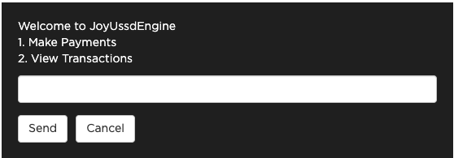

# JoyUssdEngine

A ruby library for building text based applications rapidly. It supports building whatsapp, ussd, telegram and various text or chat applications that communicate with your rails backend. With this library you can target multiple platforms(whatsapp, ussd, telegram, etc.) at once with just one codebase.

## Installation

Add this line to your application's Gemfile:

```ruby
gem 'joy_ussd_engine'
```

And then execute:

    $ bundle install

Or install it yourself as:

    $ gem install joy_ussd_engine

## Usage

The ussd engine handles user session and stores user data with redis. So in your `Gemfile` you will have to add the `redis` and the `redis-namespace` gem.
```ruby
gem 'redis'
gem 'redis-namespace'

# Not required but you can add connection pool for redis if you want
gem 'connection_pool', '~> 2.2', '>= 2.2.2'
```

After installing redis you will need to setup the redis config in your rails application inside `config/initializers/redis.rb` 
```ruby
# With Connection Pool
require 'connection_pool'
NAMESPACE = :DEFAULT_NAMESPACE
REDIS = ConnectionPool.new(size: 10) { Redis::Namespace.new(NAMESPACE, :redis => Redis.new) }
```

```ruby
# Without Connection Pool
NAMESPACE = :DEFAULT_NAMESPACE
REDIS = Redis::Namespace.new(NAMESPACE, :redis => Redis.new)
```

### Starting the App

In your rails app inside a controller create a post route and initialize the `JoyUssdEngine` by calling `JoyUssdEngine::Core.new` and providing some parameters. [Click here](#params) to view all the required parameters list.

```ruby
class MyController < ApplicationController
  skip_before_action :verify_authenticity_token

  def create
    joy_ussd_engine = JoyUssdEngine::Core.new(ussd_params, Transformers::HubtelTransformer, start_point: Ussd::Menus::StartMenu, end_point: Ussd::Menus::EndMenu)
    response = joy_ussd_engine.process
    render json: response, status: :created
  end

  def ussd_params
    params.permit(:SessionId, :Mobile, :ServiceCode, :Type, :Message, :Operator, :Sequence, :ClientState)
  end
end
```

The `JoyUssdEngine::Core.new` class takes the following parameters.<a id="params"></a>

| Parameter                        | Type  | Description                                                                                                                           |
| -------------------------------- | ----- | ------------------------------------------------------------------------------------------------------------------------------------- |
| params                           | hash  | Params from a post end point in a rails controller                                                                                    |
| [data_transformer](#transformer) | class | A class to transform the incoming and outgoing request between a particular provider and `JoyUssdEngine`                              |
| [start_point](#start_point)      | class | Points to a menu that starts the application. This menu is the first menu that loads when the app starts                              |
| [end_point](#end_point)          | class | This menu will terminate the ussd session if a particular provider (`data_transformer`) returns true in  the `app_terminator` method. |

### <a id="transformer">DataTransformer</a>

A data transformer transforms the incoming request and outgoing response between a particular provider and the `JoyUssdEngine` so they can effectively communicate between each other. The `JoyUssdEngine` can accept any request object but there are two required fields that needs to be present for it to work properly. The required fields are `session_id` and `message`. This is why the `DataTransformer` is needed to convert the request so it can provide this two required fields (`session_id`, `message`).

- #### Methods

| method         | parameters                                 | return_value  | Description                                                                                                                                                                                             |
| -------------- | ------------------------------------------ | ------------- | ------------------------------------------------------------------------------------------------------------------------------------------------------------------------------------------------------- |
| request_params | params: [hash]()                           | [hash]()      | Converts the incoming request into a format the ussd engine can understand. The hash is the params coming from the post request in a rails controller that calls `JoyUssdEngine::Core.new`.             |
| response       | message: [string](), app_state: [string]() | [hash]()      | Converts the outgoing response coming from the ussd engine into a format the provider can understand. `(eg of providers: Whatsapp, Twilio, Hubtel, Telegram, etc.)`                                     |
| release        | message: [string]()                        | [hash]()      | Converts the outgoing response coming from the ussd engine into a format the provider can understand and then terminates the application. `(eg of providers: Whatsapp, Twilio, Hubtel, Telegram, etc.)` |
| app_terminator | params: [hash]()                           | [boolean]()   | Returns a true/false on whether to terminate the app when a particular condition is met based on the provider in use. `(eg of providers: Whatsapp, Twilio, Hubtel, Telegram, etc.)`                     |
| expiration     | none                                       | [Date/Time]() | Sets the time for which to end the user's session if there is no response from the user. **Default value is 60 seconds**                                                                                |

**For Example:**
When using `hubtel` we need to convert the `hubtel` request into what the `JoyUssdEngine` expects with the `request_params` method. Also we need to convert the response back from `JoyUssdEngine` to `hubtel` with the `response` and `release` methods. With this approach we can easily extend the `JoyUssdEngine` to target multiple providers like (Twilio, Telegram, etc) with ease. The `app_terminator` returns a boolean and terminates the app when a particular condition is met(For example: On whatsapp the user sends a message with text `end` to terminate the app)

```ruby
class HubtelTransformer < JoyUssdEngine::DataTransformer
    # Transforms request payload between hubtel and our application
    # The session_id and message fields are requires so we get them from hubtel (session_id: params[:Mobile] and message: params[:Message]). 
    # And we pass in other hubtel specific params like (ClientState: params[:ClientState], Type: params[:Type])
    def request_params(params)
        {
            session_id: params[:Mobile],
            message: params[:Message],
            ClientState: params[:ClientState],
            Type: params[:Type]
        }
    end

    # We check if hubtel sends a params[:Type] == 'Release' and terminate the application 
    # OR
    # the hubtel params[:Type] is not a string with value "Initiation" and state data is blank (@context.get_state.blank?)
    def app_terminator(params)
        params[:Type] == 'Release' || (params[:Type] != "Initiation" && @context.get_state.blank?)
    end

    # Transforms response payload back to the format hubtel accepts by setting the message field (Type: "Response",Message: message, ClientState: client_state)
    def response(message, client_state)
        {
            Type: "Response",
            Message: message,
            ClientState: client_state
        }
    end


    # Transforms response payload back to the format hubtel accepts by setting the message field (Type: "Response",Message: message, ClientState: client_state) and then end the user session
    def release(message)
        {
            Type: "Release",
            Message: message,
            ClientState: "End"
        }
    end


    # Time for which the session has to end if the user does not send a request.
    def expiration
        60.seconds
    end
end
```

### Menu

Menus are simply the views for our application. They contain the code for rendering the text and menus that display on the user's device. Also they contain the business logic for your app. 

#### Properties

| properties  | type                                           | Description                                                                                                                             |
| ----------- | ---------------------------------------------- | --------------------------------------------------------------------------------------------------------------------------------------- |
| context     | object                                         | Provides methods for setting and getting state values                                                                                   |
| field_name* | string                                         | The name for a particular input field. This name can be used to later retrieve the value the user entered in that field. (**Required**) |
| menu_text*  | string                                         | The text to display to the user. (**Required**)                                                                                         |
| error_text  | string                                         | If there is an error you will have to set the error message here. (**Optional**)                                                        |
| skip_save   | boolean                                        | If set to true the user input will not be saved. **Default: false** (**Optional**)                                                      |
| menu_items  | array <{title: '', menu: JoyUssdEngine::Menu}> | Stores an array of menu items.                                                                                                          |
| field_error | boolean                                        | If set to true it will route back to the menu the error was caught in for the user to input the correct values.                         |
| menu_error  | boolean                                        | If set to true it will display an error in the current menu and end the user's session.                                                 |

#### Lifecycle Methods

| methods       | Description                                                                                                                                              |
| ------------- | -------------------------------------------------------------------------------------------------------------------------------------------------------- |
| before_render | Do all data processing and business logic here.                                                                                                          |
| render        | Render the ussd menu here. This is for only rendering out the response. (Only these methods `joy_release`, `joy_response`, `load_menu` can be used here) |
| after_render  | After rendering out the ussd menu you can put any additional logic here.                                                                                 |
| on_validate   | Validate user input here.                                                                                                                                |
| on_error      | This method will be called when the `field_error` value is set to true. You can change the error message and render it to the user here.                 |

#### Creating a menu

```ruby
class Menus::MainMenu < JoyUssdEngine::Menu
    def on_validate
        # use this method to validate the user's input

        # use @context.get_state with the @field_name value set in the before_render method to get the user inputs
        if @context.get_state[:request] != "john doe"
            # in case of errors set the @field_error value to true and set an error message in @error_text
            @field_error = true
            @error_text = "Wrong Value enter the correct value"
        end
    end

    def before_render
        # Implement before call backs

        # store the input name for this ussd menu in the @field_name variable
        @field_name = "request"

        # store the text to show or render out in the ussd menu with the @menu_text variable
        @menu_text = "Type you name"
    end

    def on_error
        # this method will be executed if @field_error is set to true

        # catch errors and display the errors in the ussd menu by setting the @menu_text to include the error_message from @error_text
        @menu_text = @field_error ? "#{@error_text}\n#{@menu_text}" : @menu_text
    end

    def after_render
        # Implement after call backs
    end

    def render
        # Render ussd menu here

        # the joy_response renders out the ussd menu and takes the class of the next menu to route to as an argument.
        joy_response(Menus::NextMenu)
    end
end
```

#### Menu Routes

You can show a list of menu items with their corresponding routes. When the user selects any menu it will automatically route to the selected menu.
When the user selects a menu that is not in the list an error is displayed to the user and the user session wil be terminated.

```ruby
class Menus::InitialMenu < JoyUssdEngine::Menu

    def before_render
        # Implement before call backs
        @field_name='initiation'
        @skip_save = true
        
        # show a list of menu items on screen with their routes
        @menu_items = [
            {title: 'Make Payments', route: Ussd::Menus::MakePayments}, 
            {title: 'View Transaction', route: Ussd::Menus::ViewTransaction}
        ]

        @menu_text = show_menu('Welcome to JoyUssdEngine')
    end

    def render
        # Render ussd menu here
        joy_response(Menus::NextMenu)
    end
end
```

This will be rendered out when this menu is executed



## Development

After checking out the repo, run `bin/setup` to install dependencies. You can also run `bin/console` for an interactive prompt that will allow you to experiment.

To install this gem onto your local machine, run `bundle exec rake install`. To release a new version, update the version number in `version.rb`, and then run `bundle exec rake release`, which will create a git tag for the version, push git commits and the created tag, and push the `.gem` file to [rubygems.org](https://rubygems.org).

## Contributing

Bug reports and pull requests are welcome on GitHub at https://github.com/[USERNAME]/joy_ussd_engine. This project is intended to be a safe, welcoming space for collaboration, and contributors are expected to adhere to the [code of conduct](https://github.com/[USERNAME]/joy_ussd_engine/blob/master/CODE_OF_CONDUCT.md).

## License

The gem is available as open source under the terms of the [MIT License](https://opensource.org/licenses/MIT).

## Code of Conduct

Everyone interacting in the JoyUssdEngine project's codebases, issue trackers, chat rooms and mailing lists is expected to follow the [code of conduct](https://github.com/[USERNAME]/joy_ussd_engine/blob/master/CODE_OF_CONDUCT.md).
